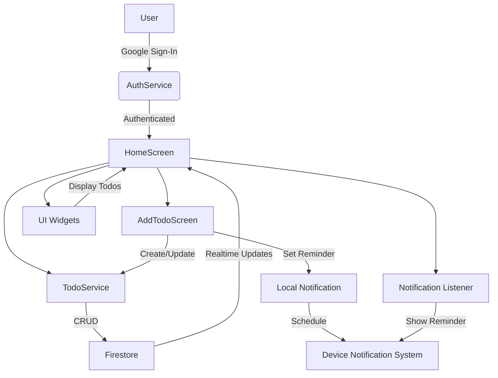

# To-Do App

A cross-platform to-do list application built with Flutter. This app allows users to manage tasks, set reminders with notifications, and sign in using Google authentication.

## Features
- Google Sign-In authentication
- Add, edit, delete, and pin to-dos
- Set reminders for tasks (with local notifications)
- Priority marking for tasks with reminders
- Responsive UI for mobile and desktop

## Setup Instructions

1. **Clone the repository:**
   ```sh
   git clone https://github.com/Akilan-y/todo.git
   cd todo
   ```
2. **Install dependencies:**
   ```sh
   flutter pub get
   ```
3. **Add your Firebase configuration:**
   - Place your `google-services.json` in `android/app/`.
   - Place your `GoogleService-Info.plist` in `ios/Runner/` (if building for iOS).
4. **Run the app:**
   ```sh
   flutter run
   ```
5. **Build the APK:**
   ```sh
   flutter build apk --release
   ```

## APK Download
You can find the working APK in the [`release/app-release.apk`](release/app-release.apk) file in this repository.

## Architecture Diagram

Below is the architecture diagram in Mermaid format. You can render it using the [Mermaid Live Editor](https://mermaid.live/) and export as PNG if needed.




## Demo Video
[Watch the demo](https://drive.google.com/file/d/1Z1ljUUCaqxvUGHxi2g3cHx5XuLs67-XK/view?usp=drivesdk) <!-- Replace with your actual Loom video link -->

## Assumptions
- The app assumes the user has a Google account for authentication.
- The app uses Firebase for authentication and Firestore for data storage.
- Notification permissions must be granted by the user for reminders to work.
- The APK provided is for demonstration and testing purposes only.

---

This project is a part of a hackathon run by https://www.katomaran.com
